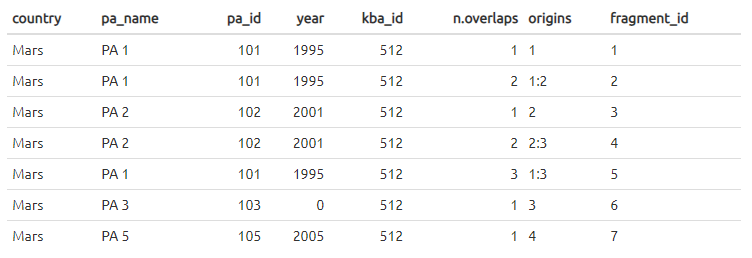

# sf-things
 testing functions in sf package

***

## fragments

_April 2020_

This is related to an overlap analysis between KBAs and Protected Areas (PAs) - see the [repo](https://github.com/BirdLifeInternational/kba-overlap) for current code.

Go to fragments folder to see the code and results for the below.

### problem

The aim is to calculate the increase in coverage of each KBA by PAs (as 'proportion of KBA area protected') over time. Most PAs have a year of designation in the dataset -> we can use this as the year that the part of the KBA covered by that PA was protected.

Sometimes multiple PAs overlap within a KBA -> we use the earliest year as the year that this part of the KBA was protected.

However, **some PAs have no year of designation** - it's missing in the dataset. This is represented by `year = 0`. To still be able to include them in the analysis, we assign these PAs a random year (and re-run the analysis e.g. 1000 times).

It's very computationally intensive to assign the random year and _then_ run the overlap analysis, so we want to improve the code to:

* make a table of 'fragments' - areas of the KBA where PAs overlap it
* record the area of each fragment, and the PAs overlapping it - along with their year of designation (including where year = 0 as this will be randomised)

This way, we only have to run the spatial KBA-PA overlap _once_ to get the fragments and their areas. Then every time we randomise the years of any PAs with `year = 0`, we just do a simple tabular analysis to calculate the building up of PA coverage for each KBA over the years.

### aims

* Split the KBA-PA overlaps into fragments, and for each fragment, record:
  * KBA id
  * PA id(s)
  * year(s) of PA designation - including 0
  * fragment area as proportion of the KBA

### process

* Make polygons from coordinates, convert them to `sf` objects.
  * Pure polygons (`sfg`) -> geometry objects (`sfc`) -> full sf objects including data frame (`sf`)

* Crop PAs to area within the KBA

* Chop the PAs into fragments - where each fragment is a unique area of overlap between different PAs (like the sections of a Venn diagram where the circles represent the PAs)

* Make data frame A with 1 row per fragment, including the origins of the fragment (= which PAs combined to make that fragment)

* Make data frame B with multiple rows per fragment, recording the various PAs and their years.

Then during the randomisation, we can:

* Assign a random year to any PAs with year 0
* Fill this year in in data frame B
* For each fragment, get earliest year of protection (may be different when it involves a randomised PA)
* Order fragments by year
* Calculate build up of the proportion of the KBA protected in each year.

