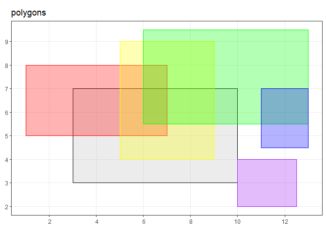
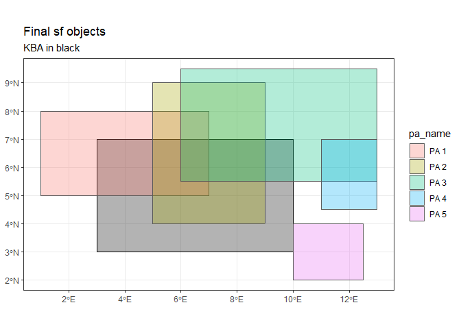
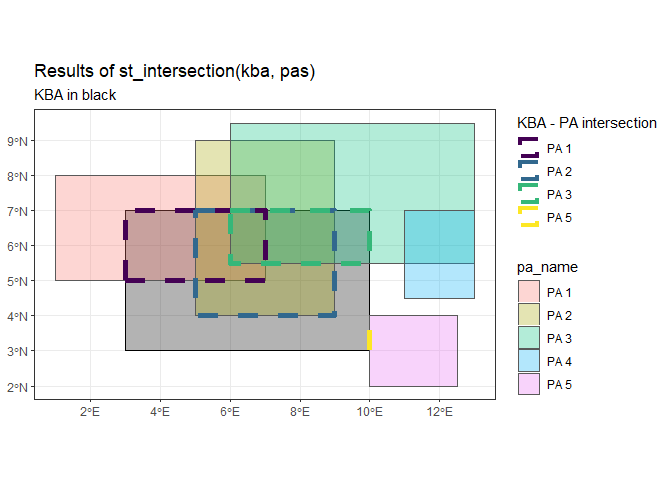
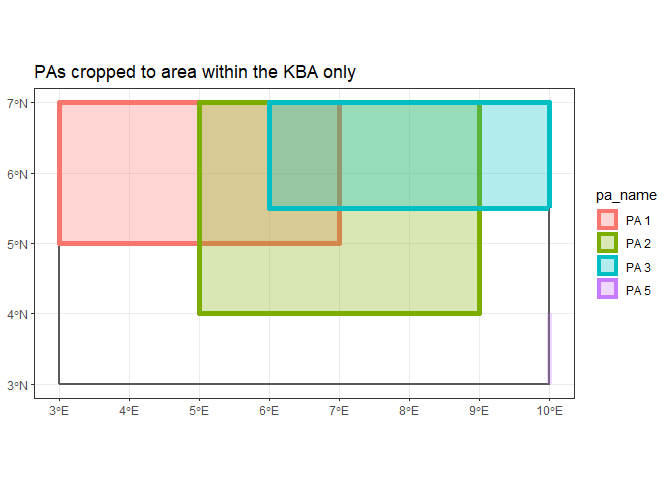
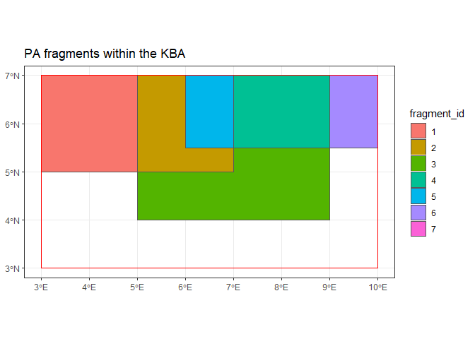

fragments
================
Lizzie Pearmain
30 April 2020

This document
-------------

1.  Make some test polygons.
2.  See what the two `sf` intersection functions do.
3.  Start developing new method for KBA-PA overlap analysis to help solve issue with random years.
    -   Crop PAs to area within the KBA
    -   Chop the PAs into fragments - where each fragment is a unique area of overlap between different PAs (like the sections of a Venn diagram where the circles represent the PAs)
    -   Make data frame A with 1 row per fragment, including the origins of the fragment (= which PAs combined to make that fragment)
    -   Make data frame B with multiple rows per fragment, recording the various PAs and their years.

*Not yet implemented:*

-   *Calculate and record area of each frament, as proportion of KBA*

<br>

------------------------------------------------------------------------

<br>

Make test data
==============

From the [sf vingette](https://cran.r-project.org/web/packages/sf/vignettes/sf1.html):

*The three classes used to represent simple features are:*

-   `sf` - *the table* (`data.frame`) *with feature attributes and feature geometries, which contains*
-   `sfc` - *the list-column with the geometries for each feature (record), which is composed of*
-   `sfg` - *the feature geometry of an individual simple feature.*

I will make my test data as: pure polygons (`sfg`) -&gt; geometry objects (`sfc`) -&gt; full sf objects including data frame (`sf`).

Make sfg polygons
-----------------

Functions:

-   `matrix()` - to make a 2-column matrix of coordinates for each polygon
-   `list()` - turn the matrix into a list for input to
-   `sf::st_polygon()` - takes a list of martices of coords and turns them into a polygon.
-   NB. to keep the PA polygons separate, need to apply `st_polygon()` separately for each PA. If you make a list of all 2 coordinate matrices, then apply `st_polygon()` to that list, it makes one polygon with 3 shapes within it.

``` r
# define kba
kba.sfg <- matrix(c(3,3,10,3,10,7,3,7,3,3), ncol=2, byrow=TRUE) %>%
  list() %>%
  st_polygon()

# define PA polygons separately
pa.1 <- matrix(c(1,5,7,5,7,8,1,8,1,5), ncol=2, byrow=TRUE) %>%
  list() %>% st_polygon()

pa.2 <- matrix(c(9,4,9,9,5,9,5,4,9,4), ncol=2, byrow=TRUE) %>%
  list() %>% st_polygon()

pa.3 <- matrix(c(6,5.5,13,5.5,13,9.5,6,9.5,6,5.5), ncol=2, byrow=TRUE) %>%
  list() %>% st_polygon()

pa.4 <- matrix(c(11,4.5,13,4.5,13,7,11,7,11,4.5), ncol=2, byrow=TRUE) %>%
  list() %>% st_polygon()

pa.5 <- matrix(c(10,2,12.5,2,12.5,4,10,4,10,2), ncol=2, byrow=TRUE) %>%
  list() %>% st_polygon()

# combine PA polygons into a list
pas.sfg <- list(pa.1, pa.2, pa.3, pa.4, pa.5)
```

Check what these `sfg` objects look like:

``` r
kba.sfg  # the KBA object is a polygon
## POLYGON ((3 3, 10 3, 10 7, 3 7, 3 3))

class(kba.sfg)  # it's an sfg object and a polygon
## [1] "XY"      "POLYGON" "sfg"

pas.sfg  # the PA object is a list of 5 individual polygons
## [[1]]
## POLYGON ((1 5, 7 5, 7 8, 1 8, 1 5))
## 
## [[2]]
## POLYGON ((9 4, 9 9, 5 9, 5 4, 9 4))
## 
## [[3]]
## POLYGON ((6 5.5, 13 5.5, 13 9.5, 6 9.5, 6 5.5))
## 
## [[4]]
## POLYGON ((11 4.5, 13 4.5, 13 7, 11 7, 11 4.5))
## 
## [[5]]
## POLYGON ((10 2, 12.5 2, 12.5 4, 10 4, 10 2))

class(pas.sfg[[1]])  # each object in the list is an sfg polygon
## [1] "XY"      "POLYGON" "sfg"
```

### Plot the polygons

Functions:

-   `ggplot()` - intiate a plot
-   `+ geom_sf(data = sf.object)` - add geom using an `sf` object

``` r
a <- 0.3  # transparency
ggplot() +
  geom_sf(data = kba.sfg, col = "black", fill = "grey", alpha = a) +
  geom_sf(data = pas.sfg[[1]], col = "red", fill = "red", alpha = a) +
  geom_sf(data = pas.sfg[[2]], col = "yellow", fill = "yellow", alpha = a) +
  geom_sf(data = pas.sfg[[3]], col = "green", fill = "green", alpha = a) +
  geom_sf(data = pas.sfg[[4]], col = "blue", fill = "blue", alpha = a) +
  geom_sf(data = pas.sfg[[5]], col = "purple", fill = "purple", alpha = a) +
  ggtitle("polygons")
```



**These polygons are sfg objects**.

We need to convert the polygons to geometries, then make that into the `geometry` column of a `data.frame` to make a normal `sf` object.

<br>

------------------------------------------------------------------------

Convert sfg to sfc
------------------

Function:

-   `sf::st_sfc()` - the arguments are:
    -   the `sfg` object, and
    -   a coordinate reference system (CRS) as either an EPSG code (here using 4326 for WSG84) or as a `proj4string` character string.

``` r
# KBA ----

kba.sfc <- st_sfc(kba.sfg, crs = 4326)  # convert to sfc

kba.sfc  # check what it looks like
## Geometry set for 1 feature 
## geometry type:  POLYGON
## dimension:      XY
## bbox:           xmin: 3 ymin: 3 xmax: 10 ymax: 7
## geographic CRS: WGS 84
## POLYGON ((3 3, 10 3, 10 7, 3 7, 3 3))

class(kba.sfc)  # check class
## [1] "sfc_POLYGON" "sfc"


# PAs ----

pas.sfc <- st_sfc(pas.sfg, crs = 4326)  # convert to sfc

pas.sfc  # check what it looks like
## Geometry set for 5 features 
## geometry type:  POLYGON
## dimension:      XY
## bbox:           xmin: 1 ymin: 2 xmax: 13 ymax: 9.5
## geographic CRS: WGS 84
## POLYGON ((1 5, 7 5, 7 8, 1 8, 1 5))
## POLYGON ((9 4, 9 9, 5 9, 5 4, 9 4))
## POLYGON ((6 5.5, 13 5.5, 13 9.5, 6 9.5, 6 5.5))
## POLYGON ((11 4.5, 13 4.5, 13 7, 11 7, 11 4.5))
## POLYGON ((10 2, 12.5 2, 12.5 4, 10 4, 10 2))

class(pas.sfc)  # check class
## [1] "sfc_POLYGON" "sfc"
```

<br>

------------------------------------------------------------------------

Convert sfc to sf
-----------------

By **adding as geometry to a data.frame**.

Function:

-   `sf::st_set_geometry()` - arguments are:
    -   the `data.frame` to which you're adding the geometry
    -   `value` is the `sfc` object to add as `geometry` to the data frame.

Side note: you could also use:

-   `sf::st_geometry()` - used to extract the `geometry` column from an sf object.
-   Can also be used to **set** the column: `sf::st_geometry(data.frame) <- my.sfc.object`.
-   However, this is not pipeable, so I'm using `sf::st_set_geometry()` instead.

``` r
# KBA ----

kba.df <- tibble(country = "Mars",
                 kba_name = "Olympus Mons National Park", 
                 kba_id = 512) %>%  # define data frame
  st_set_geometry(., value = kba.sfc)  # add geometry!

kba.df  # check what it looks like
## Simple feature collection with 1 feature and 3 fields
## geometry type:  POLYGON
## dimension:      XY
## bbox:           xmin: 3 ymin: 3 xmax: 10 ymax: 7
## geographic CRS: WGS 84
## # A tibble: 1 x 4
##   country kba_name                   kba_id                      geometry
##   <chr>   <chr>                       <dbl>                 <POLYGON [°]>
## 1 Mars    Olympus Mons National Park    512 ((3 3, 10 3, 10 7, 3 7, 3 3))

class(kba.df)  # check class
## [1] "sf"         "tbl_df"     "tbl"        "data.frame"


# PAs ----

pas.df <- tibble(country = "Mars", 
                 pa_name = c("PA 1", "PA 2", "PA 3", "PA 4", "PA 5"), 
                 pa_id = c(101, 102, 103, 104, 105),
                 year = c(1995, 2001, 0, 2007, 2005)) %>%  # define data frame
  st_set_geometry(., value = pas.sfc)   # add geometry!

pas.df  # check what it looks like
## Simple feature collection with 5 features and 4 fields
## geometry type:  POLYGON
## dimension:      XY
## bbox:           xmin: 1 ymin: 2 xmax: 13 ymax: 9.5
## geographic CRS: WGS 84
## # A tibble: 5 x 5
##   country pa_name pa_id  year                                geometry
##   <chr>   <chr>   <dbl> <dbl>                           <POLYGON [°]>
## 1 Mars    PA 1      101  1995             ((1 5, 7 5, 7 8, 1 8, 1 5))
## 2 Mars    PA 2      102  2001             ((9 4, 9 9, 5 9, 5 4, 9 4))
## 3 Mars    PA 3      103     0 ((6 5.5, 13 5.5, 13 9.5, 6 9.5, 6 5.5))
## 4 Mars    PA 4      104  2007  ((11 4.5, 13 4.5, 13 7, 11 7, 11 4.5))
## 5 Mars    PA 5      105  2005    ((10 2, 12.5 2, 12.5 4, 10 4, 10 2))

class(pas.df)  # check class
## [1] "sf"         "tbl_df"     "tbl"        "data.frame"
```

<br>

------------------------------------------------------------------------

### Plot final sf objects

Now my PAs are all in one sf object, so I can use `aes(col = pa_name)` in a `ggplot` to plot each different PA in a different colour.

``` r
a <- 0.3  # transparency
plot.ori <- ggplot() +
  geom_sf(data = kba.df, col = "black", fill = "black", alpha = a) +
  geom_sf(data = pas.df, aes(fill = pa_name), alpha = a) +
  ggtitle("Final sf objects",
          subtitle = "KBA in black")
plot.ori
```



<br>

------------------------------------------------------------------------

<br>

Test intersection functions
===========================

Testing the functions on KBA and PA datasets:

-   `sf::st_intersects()` with 2 input objects - produces a matrix of `TRUE` / `FALSE` indicating whether each pair intersects.
-   `sf::st_intersection()` with 2 input objects - produces a new `sf` object containing a feature for each intersection area of input 1 with input 2 (e.g. KBA with PA).
-   `sf::st_intersection()` with 1 input object - this fragments the onject, creating an `sf` object containing a feature for each intersection area of input 1 with itself (e.g. PAs with each other).

st\_intersects()
----------------

Produces a **matrix** of `TRUE` or `FALSE` indicating whether each pair intersect, where:

-   ROW = the KBA (here, n=1)
-   COLUMN = each of the PAs (here, n=5)

``` r
res.intersects <- sf::st_intersects(kba.df, pas.df, sparse = F)  # run intersects()
## although coordinates are longitude/latitude, st_intersects assumes that they are planar

class(res.intersects)  # check class
## [1] "matrix" "array"

res.intersects  # check what it looks like
##      [,1] [,2] [,3]  [,4] [,5]
## [1,] TRUE TRUE TRUE FALSE TRUE

# print table as kable
res.intersects %>%
  as.data.frame() %>%  # convert matrix to df
  setNames(., c("PA 1", "PA 2", "PA 3", "PA 4", "PA 5")) %>%  # set colnames
  magrittr::set_rownames("KBA 512") %>%  # set rownames
  kable()  # print table
```

|         | PA 1 | PA 2 | PA 3 | PA 4  | PA 5 |
|:--------|:-----|:-----|:-----|:------|:-----|
| KBA 512 | TRUE | TRUE | TRUE | FALSE | TRUE |

**NOTE:** Here, I have set `rownames` because this is what the current SDG code does. However, this is bad practice.

It is better to **add the KBA name in as another variable** to the data frame:

``` r
res.intersects %>%
  as.data.frame() %>%  # convert matrix to df
  setNames(., c("PA_1", "PA_2", "PA_3", "PA_4", "PA_5")) %>%  # set colnames
  mutate(KBA_id = 512) %>%  # add KBA as new column
  select(KBA_id, PA_1, PA_2, PA_3, PA_4, PA_5) %>%  # reorder columns
  kable()  # print table
```

|  KBA\_id| PA\_1 | PA\_2 | PA\_3 | PA\_4 | PA\_5 |
|--------:|:------|:------|:------|:------|:------|
|      512| TRUE  | TRUE  | TRUE  | FALSE | TRUE  |

<br>

------------------------------------------------------------------------

st\_intersection()
------------------

Produces a **new sf object** with a row for each segment of where the KBA intersects with each PA.

``` r

res.intersection <- sf::st_intersection(kba.df, pas.df)  # run the intersection()
## although coordinates are longitude/latitude, st_intersection assumes that they are planar

class(res.intersection)  # check class
## [1] "sf"         "tbl_df"     "tbl"        "data.frame"

res.intersection  # check what it looks like
## Simple feature collection with 4 features and 7 fields
## geometry type:  GEOMETRY
## dimension:      XY
## bbox:           xmin: 3 ymin: 3 xmax: 10 ymax: 7
## geographic CRS: WGS 84
## # A tibble: 4 x 8
##   country kba_name kba_id country.1 pa_name pa_id  year
## * <chr>   <chr>     <dbl> <chr>     <chr>   <dbl> <dbl>
## 1 Mars    Olympus~    512 Mars      PA 1      101  1995
## 2 Mars    Olympus~    512 Mars      PA 2      102  2001
## 3 Mars    Olympus~    512 Mars      PA 3      103     0
## 4 Mars    Olympus~    512 Mars      PA 5      105  2005
## # ... with 1 more variable: geometry <GEOMETRY [°]>
```

Note the `linestring` for the overlap with PA5 - we'll want to get rid of these in the final code as overlaps that are just two sites sharing a boundary do not concern us. UPDATE - just cropping the PAs to their area within the KBA (and removing slivers) will solve this.

Plot the resulting sf object as dashed lines on top of the previous polygon plot:

``` r
plot.ori +
  geom_sf(data = res.intersection, aes(col = as.factor(pa_name)), fill=NA, lwd=2, linetype="dashed") +
  scale_color_viridis_d() +
  labs(col = "KBA - PA intersection") +
  ggtitle("Results of st_intersection(kba, pas)")
```



<br>

------------------------------------------------------------------------

<br>

Fragments method
================

<br>

1.  **Crop PAs to just areas within the KBA**.
    -   Remove any lines (shared boundaries)
    -   Remove PAs with area &lt; 2 % the area of the KBA (for example) to remove tiny slivers of overlap due to boundary error
2.  **Fragment the new PAs**
3.  **Store multiple rows for each fragment**:
    -   KBA id
    -   fragment id
    -   fragment area
    -   Multiple rows where n = number of PAs in that fragment:
        -   PA id
        -   PA year of designation (0 if unknown)

<br>

------------------------------------------------------------------------

Crop PAs to within the KBA
--------------------------

Function:

-   `sf::st_intersection()` with **two** input `sf` objects (the KBA and the original PAs).

This produces a new `sf` object of the PAs where they intersect with the KBA.

*Note: I've removed some KBA fields from the resulting df because they're unnecessary - we've only got one KBA here!*

``` r
pas.df.new <- st_intersection(pas.df, kba.df) %>%
  select(-country.1, -kba_name)  # remove KBA columns
```

<br> **Data frame** of the resulting sf object (printed without the geometry):

``` r
pas.df.new %>%
  st_drop_geometry() %>%
  kable()
```

| country | pa\_name |  pa\_id|  year|  kba\_id|
|:--------|:---------|-------:|-----:|--------:|
| Mars    | PA 1     |     101|  1995|      512|
| Mars    | PA 2     |     102|  2001|      512|
| Mars    | PA 3     |     103|     0|      512|
| Mars    | PA 5     |     105|  2005|      512|

<br> **Plot** of the resulting sf object:

``` r
a <- 0.3
ggplot() +
  geom_sf(data = kba.df, fill=NA, lwd=1) +
  geom_sf(data = pas.df.new, lwd=2, aes(fill = pa_name, col = pa_name), alpha = a) +
  # labs(col = "kba_id") +
  ggtitle("PAs cropped to area within the KBA only")
```



Note: PA 5 is now just a line, as it shared a boundary only with the KBA.

<br>

### Clean up geometries

**At this point, we should add some code in to:**

-   Remove any non-polygon (or multipolygon) geometries - to get rid of lines like PA 5 here.
-   Remove any polygons with area &lt; 2% of the KBA area, to get rid of tine slivers where sites intersect along what should be a shared boundary, due to error.

<br>

------------------------------------------------------------------------

Make fragments
--------------

Function:

-   `sf::st_intersection()` with only **one** input `sf` object (the new PAs). I have also added a unique **fragment\_id** to identify all the fragments.

### Table

Print the output table (without the geometry column) below.

Note that **pa\_name**, **pa\_id** and **year** only include data of the *first* PA in that fragment, not the whole fragment.

We need 1 or more rows for each fragment:

-   area of fragment
-   multiple rows for each PA in the fragment:
    -   year of that PA (or 0 if unknown)

For this, we need to know **which PAs each fragment came from**.

This is saved in the `origins` column, which at the moment is a list in which each element is a numeric vector, storing the **indices** of the PAs it is made up of:

``` r
int.pas <- st_intersection(pas.df.new) %>%  # run the intersection()
  mutate(fragment_id = as.factor(c(1:nrow(.))))  # add fragment_id column
## although coordinates are longitude/latitude, st_intersection assumes that they are planar

# int.pas %>%
#   glimpse()  # look at class of each column

int.pas %>%  # print without the geometry column
  st_drop_geometry() %>%
  kable(., caption = "data frame A - one row per fragment including origin field")
```

| country | pa\_name |  pa\_id|  year|  kba\_id|  n.overlaps| origins | fragment\_id |
|:--------|:---------|-------:|-----:|--------:|-----------:|:--------|:-------------|
| Mars    | PA 1     |     101|  1995|      512|           1| 1       | 1            |
| Mars    | PA 1     |     101|  1995|      512|           2| 1, 2    | 2            |
| Mars    | PA 2     |     102|  2001|      512|           1| 2       | 3            |
| Mars    | PA 2     |     102|  2001|      512|           2| 2, 3    | 4            |
| Mars    | PA 1     |     101|  1995|      512|           3| 1, 2, 3 | 5            |
| Mars    | PA 3     |     103|     0|      512|           1| 3       | 6            |
| Mars    | PA 5     |     105|  2005|      512|           1| 4       | 7            |

``` r

int.pas$origins %>% class()  # check class of origins field - a list
## [1] "list"
```

<br>

### Plot

``` r
ggplot() +
  geom_sf(data = int.pas, aes(fill = fragment_id)) +
  geom_sf(data = kba.df, fill=NA, col = "red") +
  ggtitle("PA fragments within the KBA")
```



**Compare the following, for each fragment** (using fragment\_id):

-   Origins field in the table
-   Where the fragment is, compared to the original plots of each PA within the KBA.

**E.g. Fragment 5 (blue):**

-   This fragment came from PAs: **PA 1, PA 2, PA 3**.
-   In the cropped PAs data frame, these had the indices **1, 2, 3**.
-   Therefore the `origins` column contains `c(1:3)`.

<br>

------------------------------------------------------------------------

<br>

Origins column
--------------

-   Loop through each fragment
-   Record KBA id (all the same here), fragment id, number of PAs in that fragment
-   For each of the PA indices in the Origins column
    -   Record PA name, PA id, PA year

*Note: I've commented out the print to console steps, which I used to print out which fragment we're on, and which PA within that fragment, just for sanity-checking the code as I tested it.*

``` r

# int.pas was the result of st_intersection() above
fragments <- int.pas$fragment_id # vector of fragment ids

fragments.df <- tibble(kba_id = as.integer(),  # create empty tibble to store results
                       fragment_id = as.integer(), n_pas = as.integer(),
                       pa_name = as.character(), pa_id = as.integer(), year = as.integer())

for (i in 1:length(fragments)) {

  # cat("\nfragment_id\t", i, "\n")
  
  frag <- fragments[i]

  frag.df <- int.pas %>%
    st_drop_geometry() %>%  # get non-geom data frame
    filter(fragment_id == frag)  # just data fr this fragment

  frag.pas <- frag.df$origins %>% unlist()  # indices of PAs in this frag

  frag.num.pas <- frag.pas %>% length()  # number of PAs in this frag

  for (k in 1:frag.num.pas) {  # loop over PAs in this frag

    k.pa <- frag.pas[k]

    # cat("\t pa number:\t", k.pa, "\n")
    
    pa.index <- frag.pas[k.pa]  # get PA index in pas.df.new
    
    pa.info <- pas.df.new[k.pa, ] %>%
      st_drop_geometry()

    res.k.pa <- tibble(kba_id = as.integer(frag.df$kba_id),
                  fragment_id = as.integer(frag.df$fragment_id), 
                  n_pas = as.integer(frag.df$n.overlaps),
                  pa_name = as.character(pa.info$pa_name),
                  pa_id = as.integer(pa.info$pa_id), 
                  year = as.integer(pa.info$year))

    ## add to main results (fragments.df)
    fragments.df <- bind_rows(fragments.df, res.k.pa)
  }
}

# print out table
fragments.df %>%
  kable(., caption = "data frame B - multiple rows per fragment")
```

|  kba\_id|  fragment\_id|  n\_pas| pa\_name |  pa\_id|  year|
|--------:|-------------:|-------:|:---------|-------:|-----:|
|      512|             1|       1| PA 1     |     101|  1995|
|      512|             2|       2| PA 1     |     101|  1995|
|      512|             2|       2| PA 2     |     102|  2001|
|      512|             3|       1| PA 2     |     102|  2001|
|      512|             4|       2| PA 2     |     102|  2001|
|      512|             4|       2| PA 3     |     103|     0|
|      512|             5|       3| PA 1     |     101|  1995|
|      512|             5|       3| PA 2     |     102|  2001|
|      512|             5|       3| PA 3     |     103|     0|
|      512|             6|       1| PA 3     |     103|     0|
|      512|             7|       1| PA 5     |     105|  2005|

Further work
------------

**Still to do:**

-   Add in fragment area (as proportion of the KBA) to the final data frame
-   Test this on some real life KBA and PA polygons - as there are always unexpected issues with real (i.e. messy) data!

**Next steps in the method:**

During the randomisation, we can:

-   Assign a random year to any PAs with year 0
-   Fill this year in in data frame B
-   For each fragment, get earliest year of protection (may be different when it involves a randomised PA)
-   Order fragments by year
-   Calculate build up of the proportion of the KBA protected in each year.
